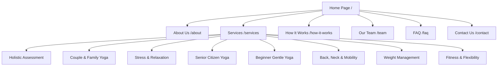

# Sadhya Wellness Bangalore — Website Architecture & Rebuilding Blueprint

This blueprint outlines the recommended structure, routing, components, and technical implementation for rebuilding the **Sadhya Wellness Bangalore** website (`bangalore.sadhyawellness.com`).

---

## 1. Information Architecture & Sitemap



### Route Table
| Route | Page Name | Primary Objective | Key Components |
| :--- | :--- | :--- | :--- |
| `/` | Home | High conversion landing page | Hero, Value Pillars, Services Grid, Why Choose Us, 4-Step Process, CTA, WhatsApp Floater |
| `/about` | About Us | Establish authority & trust | Philosophy, 15+ Yrs experience story, Founders background, Core manifesto |
| `/services` | Services | Comprehensive overview of programs | 8 Program Cards with benefits, target audience, session duration, Booking CTA |
| `/services/[slug]` | Service Detail (Optional / Dynamic) | Deep dive into specific programs | In-depth therapy benefits, instructor guidance, booking form |
| `/how-it-works` | How It Works | Remove friction & hesitation | 4 Easy Steps, Neighborhoods served map/list, Consultation booking |
| `/team` | Our Team | Highlight university credentials & masters | Instructor profiles (Kushal Dev Singh, Abhay Joshi, Harish Singh, Kavindra) |
| `/faq` | FAQ | Answer questions & boost SEO | Accordion Q&A (space required, mats, cancellation, trial sessions) |
| `/contact` | Contact Us | Lead generation | Direct Phone, WhatsApp link, Quick callback request form, Service areas |

---

## 2. Reusable Component Hierarchy

### 1. Navigation & Global Elements
- **`Navbar`**:
  - Sticky header on scroll with backdrop blur (`#f4f0ea` at 95% opacity).
  - High-res logo (`assets/logo/logo-original.png`).
  - Navigation links: Home, About, Services, How It Works, Team, FAQ, Contact.
  - Call-to-action button: *"Book Consultation"* or Direct WhatsApp icon button.
- **`WhatsAppFloater`**:
  - Fixed bottom-right badge (`bottom-6 right-6`).
  - Pulsing green button with WhatsApp icon and pre-filled message:
    `"Hi! I visited your website and would like more information about your home yoga classes."`
- **`Footer`**:
  - Background color: `#4e628a` (Midnight Slate Blue).
  - Columns: Brand bio & Logo, Quick Navigation Links, 8 Yoga Services list, Areas Served in Bangalore, Contact numbers & Copyright.

### 2. Core Section Components
- **`HeroSection`**:
  - Clean minimalist layout with subtle warm linen background (`#f4f0ea`).
  - Badge: *"Sadhya Wellness • In-Home Doorstep Yoga"*
  - H1: *"Home Yoga Classes in Bangalore"*
  - Subtitle: *"Personalized yoga sessions designed around your goals, fitness level and lifestyle — delivered at your home with professional guidance."*
  - CTA Buttons: Primary *"Book Home Consultation"* + Secondary *"Chat on WhatsApp"*.
  - Hero image: `assets/images/hero-yoga-class.jpeg`.
- **`StatsRibbon`**:
  - 4 Key Metrics:
    - `15+ Yrs` Combined Professional Experience
    - `100%` Personalized Sessions Based on Your Needs
    - `8+` Premier Bangalore Neighborhoods Covered
    - `Since 2019` Dedicated Doorstep Yoga Service
- **`ServicesGrid`**:
  - 8 Interactive Cards with image, title, excerpt, and *"Learn More / Book"* action.
  - Category tags: Mobility, Relaxation, Senior, Strength, Family.
- **`WhyChooseUs` / `ValueProps`**:
  - Comparison or feature grid highlighting:
    1. **Personalized 1-on-1 Practice**: Customized for your spine, mobility, and goals.
    2. **Doorstep Convenience**: No Bangalore traffic, no crowded studios.
    3. **University-Credentialed Instructors**: Master's in Yoga, NIS coaches, and BPT physiotherapist consultants.
- **`HowItWorksSteps`**:
  - Horizontal timeline / 4-card sequence:
    - **Step 01: Share Your Goals** (WhatsApp or Call)
    - **Step 02: Discuss Your Needs** (Assessment of routine and goals)
    - **Step 03: Meet Your Yoga Master** (Matched with right instructor)
    - **Step 04: Begin In Your Sanctuary** (Home sessions start)
- **`TeamGrid`**:
  - Clean trainer cards featuring official photos (`assets/images/team-*.png`):
    - Kushal Dev Singh (Founder & Lead Yoga Professional, Master's in Yoga, NIS Coach)
    - Abhay Joshi (Co-Founder & Senior Yoga Professional, National/International Athlete)
    - Harish Singh (Founding Partner & Chief Holistic Consultant, BPT Physiotherapy, M.A. Yoga)
    - Kavindra (Founding Partner & Regional Operations Advisor, Diploma Yoga Therapy)
- **`NeighborhoodCoverage`**:
  - Grid/Badges of Bangalore service locations: Indiranagar, HSR Layout, Koramangala, Whitefield, Sarjapur Road, Ejipura, Viveknagar, BTM Layout.
- **`FaqAccordion`**:
  - 5 High-Value FAQs addressing equipment, timing flexibility, beginners, neighborhoods, and trial sessions.
- **`LeadConsultationForm`**:
  - Simple 4-field inquiry form (Name, Phone / WhatsApp, Location in Bangalore, Preferred Yoga Goal) with instant WhatsApp or Email notification.

---

## 3. Recommended Modern Tech Stack

To build a high-performance, fast-loading, mobile-friendly website:

1. **Framework Options**:
   - **Option A (Modern Jamstack / Fast SSR)**: **Next.js 14+ (App Router)** or **Astro 4+**
     - Benefits: Superfast loading, SEO-optimized, zero unnecessary client JS, easily hosted on Vercel / Netlify / Cloudflare.
   - **Option B (Single Page Application / Lightweight)**: **Vite + React + Tailwind CSS**
     - Benefits: Instant build times, easy deployment to any static host (Hostinger, cPanel, Vercel, GitHub Pages).
   - **Option C (Clean Semantic HTML5 + Tailwind CSS)**:
     - Benefits: Ultra lightweight, zero dependencies, works anywhere.

2. **Styling & Icons**:
   - **Tailwind CSS** with custom theme tokens mapped in `tailwind.config.js`:
     ```js
     theme: {
       extend: {
         colors: {
           brand: {
             dark: '#1a2e22',
             green: '#708b77',
             emerald: '#4d997b',
             slate: '#2d4a3e',
             linen: '#f4f0ea',
             sand: '#e2e0da',
             footer: '#4e628a',
           }
         },
         fontFamily: {
           serif: ['"Hedvig Letters Serif"', 'serif'],
           sans: ['"Manrope"', 'sans-serif'],
           roboto: ['"Roboto"', 'sans-serif']
         }
       }
     }
     ```
   - **Icons**: Lucide Icons or native SVG files located in `assets/icons/`.

---

## 4. SEO & Structured Data (Schema.org)

Add the following JSON-LD Schema to the site head:

```json
{
  "@context": "https://schema.org",
  "@type": "HealthAndBeautyBusiness",
  "name": "Sadhya Wellness Bangalore",
  "image": "https://bangalore.sadhyawellness.com/assets/logo/logo-original.png",
  "url": "https://bangalore.sadhyawellness.com",
  "telephone": "+918618639113",
  "priceRange": "$$",
  "address": {
    "@type": "PostalAddress",
    "addressLocality": "Bangalore",
    "addressRegion": "Karnataka",
    "addressCountry": "IN"
  },
  "geo": {
    "@type": "GeoCoordinates",
    "latitude": 12.9716,
    "longitude": 77.5946
  },
  "openingHoursSpecification": {
    "@type": "OpeningHoursSpecification",
    "dayOfWeek": ["Monday", "Tuesday", "Wednesday", "Thursday", "Friday", "Saturday", "Sunday"],
    "opens": "06:00",
    "closes": "20:00"
  },
  "areaServed": [
    "Koramangala", "Indiranagar", "HSR Layout", "Whitefield", "Sarjapur Road", "Ejipura", "Viveknagar", "BTM Layout"
  ],
  "description": "Book certified Home Yoga Classes in Bangalore. Personalized doorstep yoga sessions for pain relief, flexibility, strength & overall wellness."
}
```
